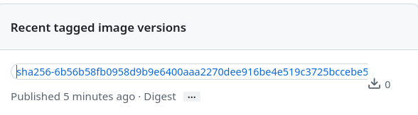
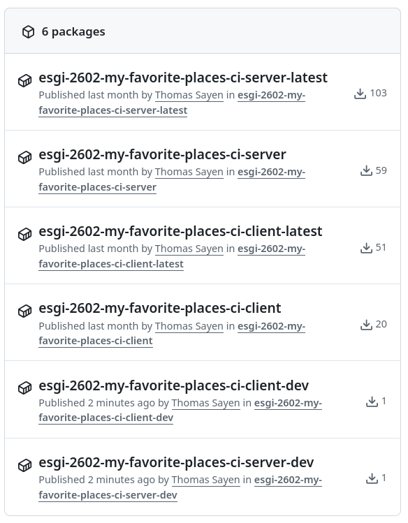

# Docker CI

## Exercice 1 - compiler les images Docker

1. Dans le projet MFP, mettez en place une CI Github Actions qui compile vos images Docker à chaque push sur votre branche principale (main ou master), l'image doit être stockée sur le  registry Github directement

Récupération du modèle de configuration de la documentation officielle de GitHub (d'où les nombreux commentaires dans le fichier): https://docs.github.com/en/actions/tutorials/publish-packages/publish-docker-images#publishing-images-to-github-packages  

Exemple de [.github/workflows/client.yml](.github/workflows/client.yml) :  

```yaml
on:
  push:
    branches: ['master']
```
`master` est la branche principale.  

```yaml
jobs:
  build-and-push-image:
    steps:
      - name: Checkout repository
        uses: actions/checkout@v5
      # Uses the `docker/login-action` action to log in to the Container registry registry using the account and password that will publish the packages. Once published, the packages are scoped to the account defined here.
      - name: Log in to the Container registry
        uses: docker/login-action@65b78e6e13532edd9afa3aa52ac7964289d1a9c1
        with:
          registry: ${{ env.REGISTRY }}
          username: ${{ github.actor }}
          password: ${{ secrets.GITHUB_TOKEN }}
      # This step uses [docker/metadata-action](https://github.com/docker/metadata-action#about) to extract tags and labels that will be applied to the specified image. The `id` "meta" allows the output of this step to be referenced in a subsequent step. The `images` value provides the base name for the tags and labels.
      - name: Extract metadata (tags, labels) for Docker
        id: meta
        uses: docker/metadata-action@9ec57ed1fcdbf14dcef7dfbe97b2010124a938b7
        with:
          images: ${{ env.REGISTRY }}/${{ env.CLIENT_IMAGE_NAME }}
      # This step uses the `docker/build-push-action` action to build the image, based on your repository's `Dockerfile`. If the build succeeds, it pushes the image to GitHub Packages.
      # It uses the `context` parameter to define the build's context as the set of files located in the specified path. For more information, see [Usage](https://github.com/docker/build-push-action#usage) in the README of the `docker/build-push-action` repository.
      # It uses the `tags` and `labels` parameters to tag and label the image with the output from the "meta" step.
      - name: Build and push Docker image
        id: push
        uses: docker/build-push-action@f2a1d5e99d037542a71f64918e516c093c6f3fc4
        with:
          context: server
          push: true
          tags: ${{ steps.meta.outputs.tags }}
          labels: ${{ steps.meta.outputs.labels }}
```

Ces deux processus permettent de se connecter au registry GitHub (avec des `secrets` entre `${{...}}` pour ne pas divulguer d'informations sensibles), pour ensuite y envoyer l'image Docker compilée.  
`${{ env.REGISTRY }}/${{ env.CLIENT_IMAGE_NAME }}` vient préciser le nom de l'image (soit `<nom du repo>-client-latest`).  

Même démarche pour [.github/workflows/server.yml](.github/workflows/server.yml).  

##

> 2. Testez votre CI et vérifiez que les images sont bien crées, créez ensuite un fichier compose.prod.yml 
dans votre projet, copiez-collez le contenu de compose.yml déjà existant, et faites les modifications 
nécessaires pour que toutes les instructions build disparaissent en faveur d'image


## Exercice 2 - améliorer la CI

> 1. En cherchant des exemples sur le net, mettez à jour votre CI pour qu'elle produise des images taguées latest mais aussi avec le SHA du dernier commit pour pouvoir gérer des versions

```yml
- name: Extract metadata (tags, labels) for Docker
  id: meta
  uses: docker/metadata-action@9ec57ed1fcdbf14dcef7dfbe97b2010124a938b7
  with:
    images: ${{ env.REGISTRY }}/${{ env.CLIENT_IMAGE_NAME }}
    tags: type=sha # Récupère le SHA (hash) du commit Git
```
Ajouter la ligne `tags: type=sha` pour que l'action `metadata` (avec l'ID `meta`) extraie le SHA du commit...  
```yml
- name: Build and push Docker image
        id: push
        uses: docker/build-push-action@f2a1d5e99d037542a71f64918e516c093c6f3fc4
        with:
          context: server
          push: true
          tags: ${{ steps.meta.outputs.tags }}
          labels: ${{ steps.meta.outputs.labels }}
```
...Car on remarque plus loin que les tags de l'image sont `${{ steps.meta.outputs.tags }}`, soit ceux que renvoie l'action précédente.  

Résultat (voir: https://github.com/Chi-Iroh/esgi-2602-my-favorite-places-ci/pkgs/container/esgi-2602-my-favorite-places-ci-client-latest) :  


##

> 2. Mettez à jour votre workflow pour qu'il compile l'image de front et/ou de back uniquement si des fichiers ont changés dans les dossiers (ie. ne pas compiler le front si le push ne l'a pas modifié)

```yml
on:
  push:
    branches: ['master']
    paths:
      - 'client/**'
```
Dans le client, ajouter `paths: - 'client/**'` va indiquer à GitHub de ne déclencher le fichier d'actions si et seulement si des modifications ont eu lieu dans `client/**`.  
Même chose pour la configuration serveur, où il faut néanmoins remplacer le chemin par `server/**`.  

##

> 4. Créez une branche dev qui génère une image taguée dev à chaque push

```yml
on:
  push:
    branches: ['master', 'dev']
    paths:
      - 'client/**'
```
Rajouter la branche `dev` pour permettre à GitHub d'exécuter l'action dans cette branch-là aussi.  

```yml
env:
    CLIENT_IMAGE_NAME: ${{ github.repository }}-client-${{github.ref_name == 'master' && 'latest' || 'dev'}}
```
Ajout d'une condition pour nommer l'image différemment selon la branche, `-dev` sur `dev`, et `-latest` sur `master`.  

On a donc plus d'images :  


Exemple pour l'image client: https://github.com/Chi-Iroh/esgi-2602-my-favorite-places-ci/pkgs/container/esgi-2602-my-favorite-places-ci-client-dev  

## Exercice 3 - ajouter des tests

> 1. Dans le projet MFP, ajouter les outils de tests unitaires (jest) et écrivez au moins un test unitaire, par exemple pour la fonction getDistance, vérifiez que le test fonctionne en local

Dans [./server/__tests__/distance.ts](./server/__tests__/distance.ts) :  

```typescript
import { getDistance } from "../src/utils/getDistance"
import { describe, expect, test } from "@jest/globals";

describe("distance", () => {
    test("(50;50) -> (-10;-10) --> should ~ 8 831,87 km", () => {
        expect(getDistance({ lng: 50, lat: 50 }, { lng: -10, lat: -10 })).toBeCloseTo(8831.87)
    })
})
```

Pour tester manuellement :  
```bash
cd server
npm run test
```

##

> 2. Configurez ensuite les Github Actions de sorte à exécuter automatiquement les tests à chaque ajout de code (push, peu importe la branche, faites un nouveau workflow)

Nouveau fichier [./.github/workflows/test.yml](./.github/workflows/test.yml) :  
```yml
name: Run tests
on: push
jobs:
  build:
    runs-on: ubuntu-latest
    steps:
    - uses: actions/checkout@v2
    - name: Install modules
      run: |
        cd server
        npm install
        npm run test
```

Installe les dépendances et démarre les tests, lors d'un `push` sur n'importe quelle branche.  

##

> 3. Configurez votre repo pour protéger la branche principale et n'autoriser le merge des PR que si la CI des tests passe, faites un test en créant une nouvelle branche + PR

Configuration de la protection de branche :  


`Status checks that are required` = quelles tests peuvent bloquer la PR s'ils ne passent pas.  
`build-and-push-image` = nom du test dans le YAML.  

##

> 4. Faites une modification dans le code de la fonction ou du test pour le faire échouer, vérifiez que la PR est bloquée

Le commit [1d7e14](https://github.com/Chi-Iroh/esgi-2602-my-favorite-places-ci/pull/10/changes/1d7ed14e93638b9b83a6d483926d9822049e18d3) sabote la fonction `getDistance` pour renvoyer 0 tout le temps.  
La Pull Request est bloquée :  


Voir ici: https://github.com/Chi-Iroh/esgi-2602-my-favorite-places-ci/pull/10
